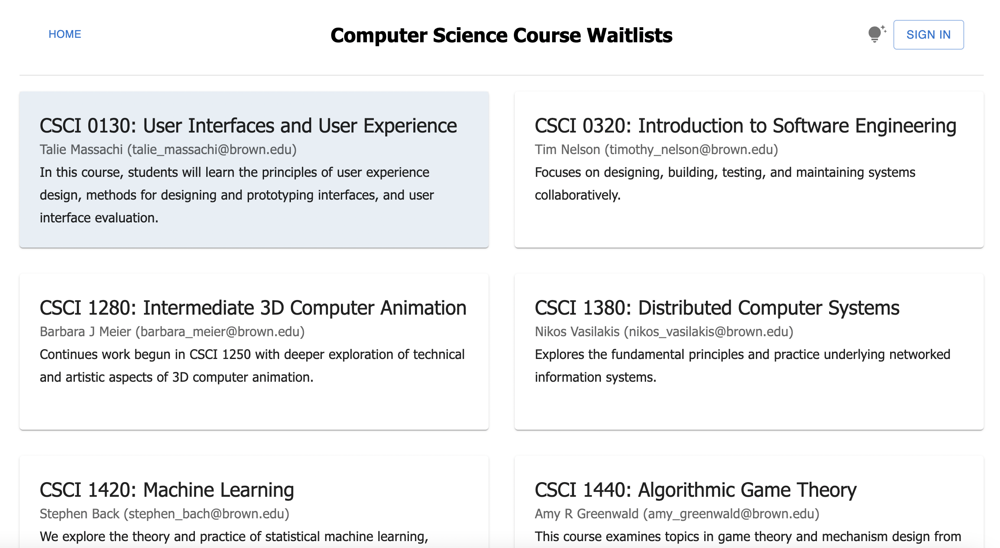
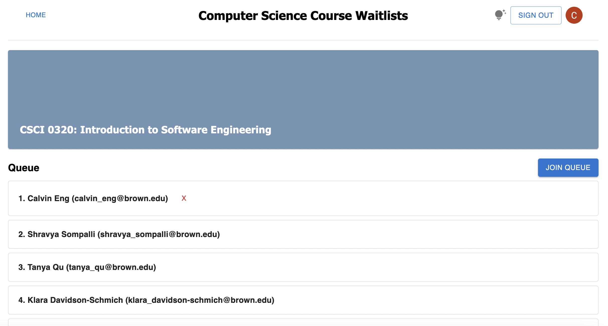
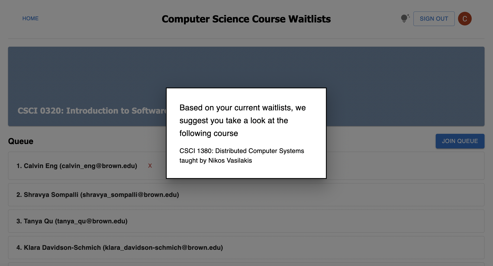

Course Waitlists
=============
### Authors: Calvin Eng, Aanya Hudda, Tabitha Lynn, and Shravya Sompalli
Link to Project-
https://github.com/Calvineng72/Course-Waitlists.git
## Project Details
Course Waitlists is a project dedicated to solving issues related to course registration, focusing specifically on course waitlists. In order to reduce stress, our web application allows students to join and leave course waitlists if they are unable to register for a class. Students can view their position relative to other students and, as an additional feature, have the option to receive course recommendations. Our algorithm suggests courses based on the waitlists of other students interested in the same class. Student info is stored in the backend and is accessed with SQLite, while our server is run with Spark. Only users with a brown.edu email address may use the waitlist, as Google Authentication is required. Integration testing is done with mocks, and tests can be found for the backend server in the folder `__test__`.

  
  
  

    
## Getting Started

First, clone the repository:

    git clone https://github.com/Calvineng72/Course-Waitlists.git
      
Then, install the required dependencies: 
 
    npm install
      
Next, run the development server:

    npm run dev
    
Finally, execute the backend server and go to the following link:

    http://localhost:3000
  
## Design Choices

**Frontend:**
  
On the frontend, we decided to implement Next.js as the main framework for our app. Next.js provided us with in-depth tutorials and examples for the frontend design that we were hoping to achieve. We also wanted to learn how to use Next.js as a learning experience; it was really interesting to implement a framework that we hadn't used before and learn what it's like to utilize online resources to teach ourselves. 

We decided to implement Google Authentication into a sign-in button instead of making it a first page that prevents you from entering the screen before you sign in. There were a couple of reasons for this choice, but one of them was simply being able to see the page whether or not you've logged in now. In retrospect, we did not fully consider the security of this choice; anyone, regardless of whether they go to Brown or not, can see every class and the waitlists.

We also chose to use Next Auth instead of Google OAuth. Although we attempted both, Next Auth provided the best built-in structure for user authentication. This method of authentication also makes it very simple to add another authentication provider (i.e., Github). 

For our front-end styles, we prioritized user accessibility. The font we used, Verdana, is listed as one of the most accessible CSS font families. Additionally, we paid close attention to the contrast of the colors to provide the most accessible user experience. That included a higher font weight for the header, a non-white color when the class boxes are hovered over, white text against a blue background in each class, and a clear red X for removing yourself from the waitlist.  

**Backend:**
  
In terms of the background, the most significant decision we made was to keep the waitlists in a SQL database. We considered other methods that were common for the final project, like Mongo and Firebase, but we ultimately decided that SQL would be the simplest way to accomplish our goals. SQL is a simple way of storing data — especially because our course list/student data was on the more simplistic end — and we knew it was compatible with Java. After speaking to a TA in collab hours and discussing more in-depth with our mentor TA, we also came to the conclusion that the 32 TAs all had at least some experience with SQL (because of the lab last year) and would be able to support us to some capacity. 

One of the first choices we had to make as we were narrowing the scope of our project was who our target user was. Initially, we thought about having two different user profiles with different capabilities, but we decided that we wanted our main focus to be on the students. As students ourselves, we know firsthand the direct desires of students from a waitlist app, so being able to implement the user experience for students would be much easier. Based on our cumulative knowledge and goals for the project, we decided to narrow the focus of the app to be student-facing. This meant that our backend database was hardcoded by us, with the understanding that if used in a real scenario, that would be the equivalent of a professor being able to change people on the list at will.
